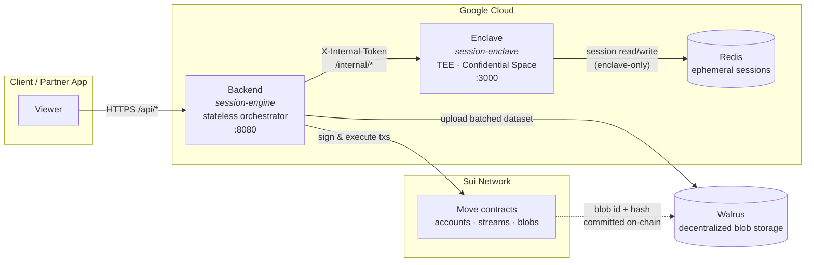
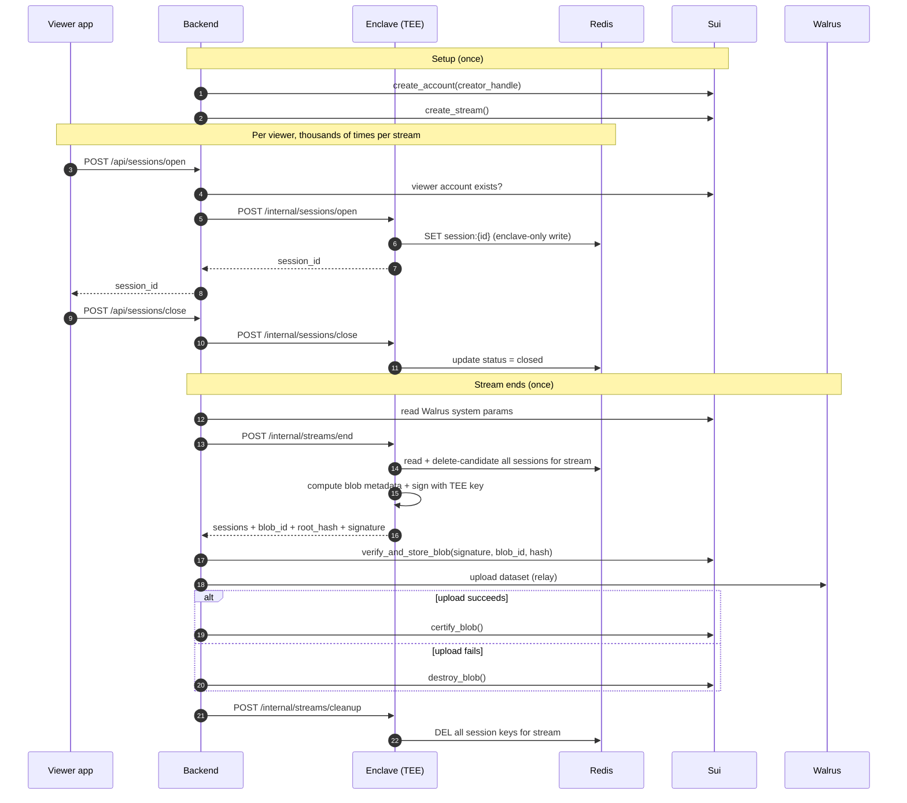

# Aava

**A programmable session layer for streaming, settled on Sui.**

Aava turns a video stream into a set of verifiable, short-lived **sessions** (one per viewer, per watch) that can be opened and closed off-chain at high throughput, then closed out as a single **cryptographically attested, on-chain-verifiable** batch when the stream ends. It's the plumbing needed to eventually answer questions like *"did this viewer actually watch this ad?"* or *"how many verified sessions did this stream have?"* without trusting a single company's database.

> **Status:** research prototype. Core session lifecycle, on-chain settlement, and TEE attestation are implemented and running end-to-end on Sui **testnet** + **GCP Confidential Space**. Not production-hardened.

`Rust` · `Move` · `Sui` · `Walrus` · `Axum` · `Redis` · `GCP Confidential Space`

---

## Table of contents

- [The problem](#the-problem)
- [The idea](#the-idea)
- [Architecture at a glance](#architecture-at-a-glance)
- [How a stream's life cycle works](#how-a-streams-life-cycle-works)
- [Components](#components)
- [Design decisions & trade-offs](#design-decisions--trade-offs)
- [Security model](#security-model)
- [On-chain contracts](#on-chain-contracts)
- [Repository layout](#repository-layout)
- [Running it locally](#running-it-locally)
- [Trying the API](#trying-the-api)
- [Deploying the enclave](#deploying-the-enclave)
- [Roadmap](#roadmap)
- [Further reading](#further-reading)

---

## The problem

Streaming platforms today make claims like "10M viewers watched this ad", "this session was legitimate" that advertisers, rights holders, and auditors have to take on faith, because the only record lives in a private database. At the same time, a **blockchain cannot be the database**: a popular live stream can open and close millions of sessions per minute, and no L1 (Sui included) can, or should, absorb a transaction per viewer-second.

Aava's bet: keep the **volume off-chain** and the **trust on-chain**. Every session is created and managed off-chain for speed, but the component that touches session data is a **Trusted Execution Environment (TEE)** that cryptographically signs the batch it produces. That signature (not a company's word) is what gets verified when the batch settles on Sui.

## The idea

```
   high throughput, ephemeral              low throughput, durable, trustless
◄──────────────────────────────►    ◄───────────────────────────────────────►

   Session open/close, per-viewer          Stream identity, account identity,
   (millions/stream, sub-ms latency)        blob commitments, settlement proofs
```

- **Off-chain, fast path:** a TEE-backed service owns session state end-to-end. Nothing outside the enclave writes session data.
- **On-chain, trust path:** Sui holds *accounts*, *streams*, and *commitments* (a blob id + a signed hash), never the raw per-session dataset.
- **Cold storage:** the actual batched dataset (every session that happened in a stream) is archived to **Walrus**, addressed by the blob id that was committed on-chain — anyone can fetch it and check it against the signature.
- **The enclave is the only trust upgrade.** The backend that talks to Sui, builds transactions, and uploads to Walrus is a dumb, stateless, *replaceable* orchestrator. If you don't trust Aava's backend, you don't have to, you only have to trust that the enclave's signing key never left the TEE, which is independently checkable via **remote attestation**.

## Architecture at a glance



Two Rust services, one Move package:

| | |
|---|---|
| **`backend`** | Public API. Talks to Sui and Walrus. Holds no session state. |
| **`enclave`** | Runs inside a TEE. The *only* thing allowed to touch session data. Signs every batch it produces. |
| **`contract`** | Move package on Sui: accounts, streams, blob lifecycle, enclave attestation registry. |

## How a stream's life cycle works



The key property: **the backend never sees a session before the enclave attests it.** By the time a session exists in the dataset the backend hands to Sui, it has already been signed by a key that (in production) never leaves a GCP Confidential Space VM.

## Components

### `backend`: `session-engine`

Stateless HTTP API (Axum) with **no database**. Its `AppState` holds nothing but a Sui RPC client. Every request either:
- reads/writes Sui directly (accounts, streams), or
- proxies to the enclave over an internal, token-authenticated channel, or
- orchestrates a multi-step flow across Sui + the enclave + Walrus (stream end).

Built on Mysten's `sui-rpc` / `sui-transaction-builder` / `sui-crypto` Rust SDKs — transactions are built, signed by the operator wallet, and executed server-side, so the viewer/creator never needs to touch gas or a wallet extension.

### `enclave`: `session-enclave`

The trust anchor. An Axum service designed to run inside **GCP Confidential Space** (AMD SEV-SNP, secure boot), holding an ephemeral Ed25519 keypair generated at boot and never persisted. Responsibilities:

- **Session state machine**: `opened → warned → revoked → closed`, with transition validation (a closed session cannot be reopened, a revoked one cannot be un-revoked).
- **Sole Redis writer**: session records live in Redis with the enclave as the only client that ever connects to it.
- **Batch attestation**: on stream end, reads every session for a `stream_id`, computes deterministic **Walrus blob metadata** (blob id, root hash, encoding) directly from the dataset bytes, and signs an intent-scoped message with its keypair.
- **Remote attestation**: exposes `/attestation`, returning a Google-signed OIDC JWT binding the enclave's public key to the *measured* container image, so anyone can verify the code that produced a signature is the code that was published (`contract/sources/enclave.move` stores the expected image digest on-chain).

### `contract`: Move package on Sui (`aava`)

| Module | Responsibility |
|---|---|
| `account_registry` | Shared registry viewers/creators are derived from, keyed by off-chain handle (via `derived_object`) |
| `viewer` | Viewer accounts, sanction history |
| `creator` | Creator accounts, streams, blob lifecycle (`active → verified → stored`/`invalid`), session sanctions (`flag_session`) |
| `enclave` | On-chain record of the *expected* TEE image digest, used to verify attestation before trusting a signature |
| `protocol_authority` | Capability-gated requests between modules |

Deployed and published on **Sui testnet** - see [`contract/Published.toml`](contract/Published.toml) for the live package id.

## Design decisions & trade-offs

Building this surfaced a handful of real forks in the road. What we picked, and why:

| Decision | Why | What we gave up |
|---|---|---|
| **Sessions off-chain, streams/accounts on-chain** | A stream can generate orders of magnitude more session events than Sui (or any L1) should absorb as individual transactions. Accounts and streams change rarely and *need* trustless permanence. | Sessions aren't individually verifiable on-chain in real time — only as part of a signed batch after the fact. |
| **Redis over Postgres for session state** | Sessions are ephemeral (minutes to hours) and read/written at high frequency; a relational store with WAL/durability guarantees is solving a problem we don't have. Redis pipelines give us atomic multi-key writes without that overhead. | No SQL joins/ad-hoc querying — the enclave is the only consumer, so this wasn't a real constraint. |
| **TEE attestation instead of "trust the server"** | The whole point is that advertisers/rights holders shouldn't have to trust Aava's backend. A TEE lets us *prove* which code touched the data, via a signature tied to an on-chain-recorded image digest. | Real complexity: Confidential Space deployment, attestation plumbing, and the honest caveat that TEEs (like any hardware trust root) are a security *upgrade*, not a silver bullet. |
| **Backend is stateless and disposable** | If the backend can be redeployed, scaled, or even compromised without corrupting the session record, the enclave boundary is doing its job. | The backend cannot itself be an offline source of truth — every read of "current sessions" goes through the enclave. |
| **Batch settlement (register → upload → certify/destroy) instead of one atomic call** | Sui transactions, Walrus uploads, and relay availability are three separate failure domains. Splitting them lets us **explicitly handle partial failure** (an uploaded-but-uncertified blob is destroyed rather than left dangling) instead of hoping one big call never fails halfway. | More moving parts to reason about per stream-end; mitigated by keeping the sequence linear and well-logged rather than parallelizing it. |
| **Sequential orchestration, not manual task parallelism** | The stream-end flow is a genuine dependency chain (need shard count before fetching the dataset; need the register tx's effects before uploading; need the upload result before choosing certify vs. destroy). Forcing parallelism here would trade correctness for a speedup on a path that isn't the bottleneck. | We rely on Tokio's request-level concurrency (many streams ending at once are still handled concurrently) rather than intra-request parallelism. |
| **Handle-derived account IDs (`derived_object`)** | Off-chain handles (`creator_handle`, `viewer_handle`) deterministically map to on-chain object ids, so the backend never has to store a handle → object-id table. | Handles must be unique and immutable per account by construction. |

## Security model

**Threat model, short version:** the backend is not trusted with raw session data; only the enclave is, and only for as long as it holds the attestation-bound key.

1. **Isolation**: only the enclave process ever opens a connection to Redis. The backend has no Redis client at all.
2. **Internal auth**: every enclave route under `/internal/*` requires an `X-Internal-Token` header matching a shared secret; anything without it is rejected before touching session logic.
3. **Attestation, not assertion**: a session batch isn't "probably fine because our server said so." It's a signature over a deterministic hash of the exact bytes, produced by a key whose corresponding public key is bound (via Google's Confidential Space attestation service) to a specific, on-chain-recorded container image digest.
4. **On-chain as the check, not the ledger**: Sui doesn't store the dataset; it stores the blob id + root hash + signature. Verification means: fetch the blob from Walrus by id, recompute the hash, confirm it matches what was signed. Nothing about this requires trusting Aava afterward.
5. **Explicit failure paths**: a blob that gets registered on-chain but fails to upload to Walrus is *destroyed* on-chain rather than left as a dangling, unverifiable commitment.

Full write-ups: [`SECURITY.md`](SECURITY.md) (Redis/data lifecycle threat model) and [`ARCHITECTURE.md`](ARCHITECTURE.md) (system-level trust boundaries and flows).

## Repository layout

```
aava/
├── backend/          Rust — stateless API orchestrator (Sui + Walrus + enclave client)
│   ├── src/api/      HTTP routes: creators, viewers, sessions, streams, actions
│   ├── src/sui/      RPC reads, transaction builders, signer/executor
│   ├── src/walrus/   Blob upload + tip/payment handling
│   └── src/enclave/  Typed HTTP client for the enclave's internal API
├── enclave/          Rust — TEE service (session state, batch attestation)
│   ├── src/sessions.rs   Session state machine, Redis reads/writes
│   ├── src/streams.rs    Stream-end batching, blob metadata, signing
│   ├── src/gcp_attestation.rs   Confidential Space JWT attestation
│   └── conf_space.tf, deploy.sh, Makefile   GCP deployment stack
├── contract/         Move package published on Sui testnet
│   └── sources/      account_registry, viewer, creator, enclave, protocol_authority
├── ARCHITECTURE.md   System design: layers, trust boundaries, request flows
└── SECURITY.md       Redis/data-lifecycle threat model
```

## Running it locally

**Order:** Redis → Enclave → Backend.

```bash
# 1. Redis (dev: no password; see SECURITY.md for production config)
redis-server

# 2. Enclave
cd enclave
export ENCLAVE_INTERNAL_TOKEN=your-shared-secret
export REDIS_URL=redis://localhost:6379   # add :password@ if Redis requires auth
RUST_LOG=info cargo run

# 3. Backend (new terminal)
cd backend
export ENCLAVE_INTERNAL_TOKEN=your-shared-secret   # must match the enclave
RUST_LOG=info cargo run
```

The backend logs its Sui operator wallet address on boot and serves interactive API docs at **`http://127.0.0.1:8080/docs`** (Swagger UI over `/openapi.json`).

| Variable | Service | Purpose |
|---|---|---|
| `ENCLAVE_INTERNAL_TOKEN` | both | Shared secret authenticating backend → enclave calls |
| `ENCLAVE_URL` | backend | Enclave address (default `http://localhost:3000`) |
| `REDIS_URL` | enclave | Redis connection string (default `redis://localhost:6379`) |
| `SESSION_ENGINE_HOST` / `_PORT` | backend | Bind address (default `127.0.0.1:8080`) |

## Trying the API

```bash
# Create a creator account (tx built, signed & executed server-side)
curl -X POST http://127.0.0.1:8080/api/creators/create \
  -H "Content-Type: application/json" \
  -d '{"creator_handle":"your_handle"}'

# Start a stream
curl -X POST http://127.0.0.1:8080/api/streams/start \
  -H "Content-Type: application/json" \
  -d '{"creator_handle":"your_handle"}'

# Create a viewer, open a session against the stream
curl -X POST http://127.0.0.1:8080/api/viewers/create \
  -H "Content-Type: application/json" -d '{"viewer_handle":"viewer1"}'

curl -X POST http://127.0.0.1:8080/api/sessions/open \
  -H "Content-Type: application/json" \
  -d '{"viewer_handle":"viewer1","stream_id":"<STREAM_OBJECT_ID>"}'

# Close it, or check its status
curl -X POST http://127.0.0.1:8080/api/sessions/close \
  -H "Content-Type: application/json" -d '{"session_id":"<SESSION_ID>"}'

curl -X POST http://127.0.0.1:8080/api/actions/status \
  -H "Content-Type: application/json" -d '{"session_id":"<SESSION_ID>"}'

# End the stream: batches every session, registers + certifies the blob on Sui,
# uploads the dataset to Walrus — all server-side.
curl -X POST http://127.0.0.1:8080/api/streams/end \
  -H "Content-Type: application/json" \
  -d '{"creator_handle":"your_handle","stream_id":"<STREAM_OBJECT_ID>"}'
```

<details>
<summary>Full route list</summary>

| Method | Path | Purpose |
|---|---|---|
| `POST` | `/api/creators/create`, `/get`, `/exists` | Creator accounts |
| `POST` | `/api/viewers/create`, `/get`, `/exists` | Viewer accounts |
| `POST` | `/api/streams/start`, `/end` | Stream lifecycle |
| `POST` | `/api/sessions/open`, `/close`, `/get` | Session lifecycle |
| `POST` | `/api/actions/warn`, `/revoke`, `/status` | Creator-issued session sanctions |
| `GET` | `/docs`, `/openapi.json` | Interactive API reference |

</details>

## Deploying the enclave

The enclave is designed to run on **GCP Confidential Space** (AMD SEV, measured boot), so its attestation can be checked against the image digest recorded on-chain. Full instructions — Terraform stack, IAM setup, image rotation, troubleshooting — are in [`enclave/README.md`](enclave/README.md).

```bash
cd enclave
cp terraform.tfvars.example terraform.tfvars   # set project_id, enclave_internal_token, redis_url
make init && make deploy
```

## Roadmap

- [x] End-to-end session lifecycle with batch attestation
- [x] Sui testnet integration for account/stream/blob transactions
- [x] Walrus integration for dataset archival
- [x] GCP Confidential Space deployment for the enclave
- [ ] Production hardening (Redis TLS/ACLs, secret management, monitoring)
- [ ] Event listener + richer action API (mid-session sanctions, live analytics)
- [ ] Device-local session signing (viewer wallet as the source of session authenticity)
- [ ] Ad placement + verified rendering pipeline

## Further reading

- [`ARCHITECTURE.md`](ARCHITECTURE.md) — layer-by-layer system design, trust boundaries, request flows
- [`SECURITY.md`](SECURITY.md) — Redis/data-lifecycle threat model
- [`enclave/README.md`](enclave/README.md) — GCP Confidential Space deployment guide
- [`enclave/gcp_registration_guide.md`](enclave/gcp_registration_guide.md) — on-chain enclave registration flow

---

*Individual crates are licensed Apache-2.0 (see `enclave/Cargo.toml`, `contract/Move.toml`).*
